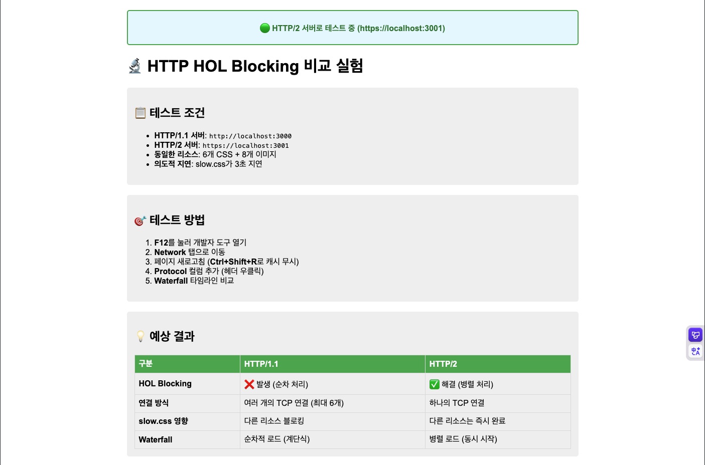
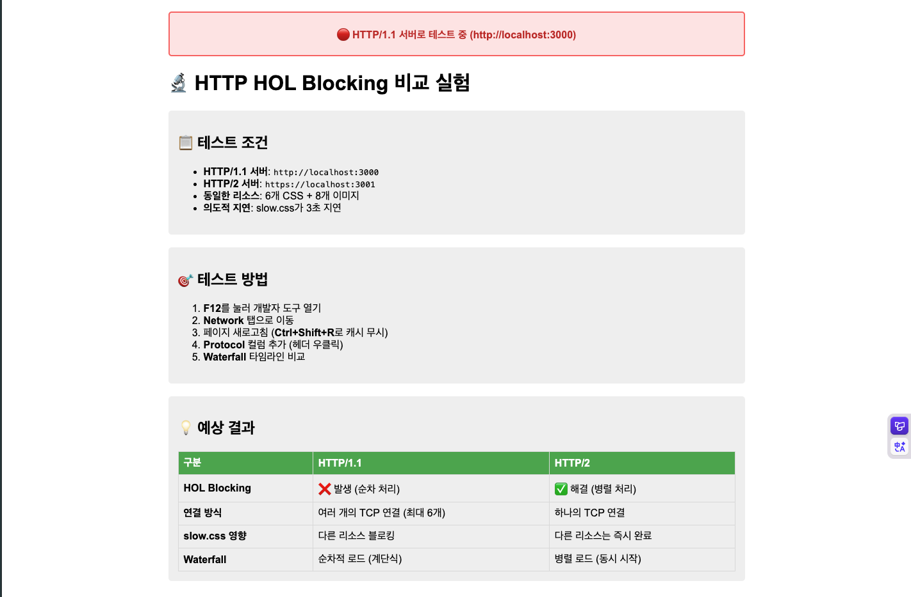
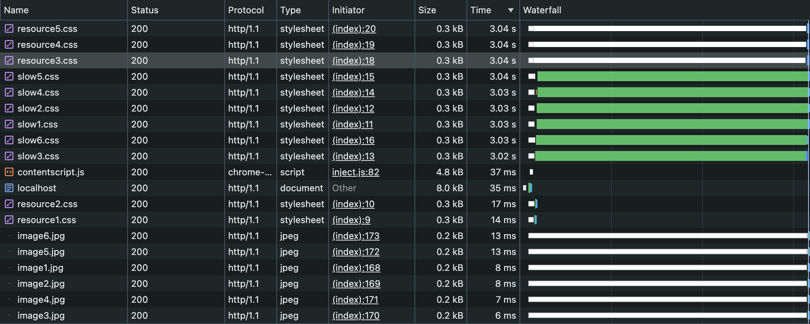
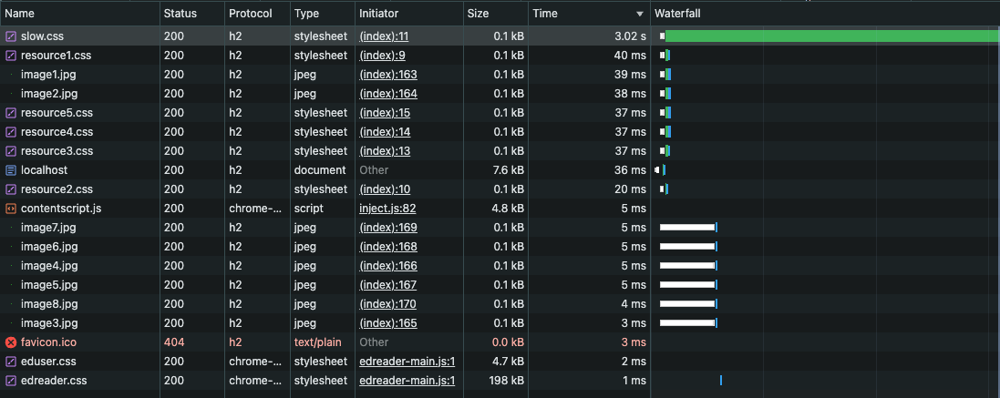
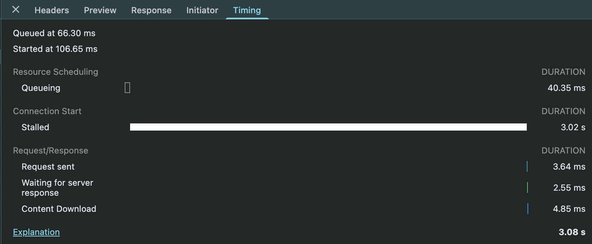
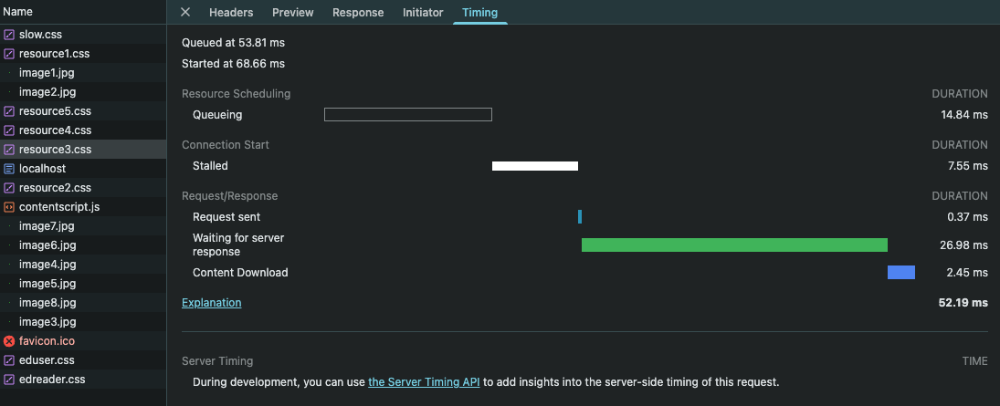
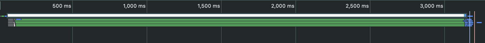
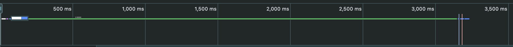

## http/0.9

### 개요

- 요청 메서드: GET
- 응답이 무조건 HTML 인 단순한 형태

### 문제점

웹의 인기로 기존 HTTP 사양만으로는 요구사항을 충족할 수 없게되고 여러 기능들이 추가되기 시작했습니다.
명시적으로 약속된 사양이 없어 서버-클라이언트 사이 혼란이 생겨났고 이를 표준화하기 위해 HTTP WG(Working Group)이라는 조직이 탄생합니다.

## HTTP/1.0

### 개요

- 요청 메서드: GET, HEAD, POST
- 상태 코드, 헤더 필드 추가
- 헤더의 Content-type 을 통해 HTML 이외의 타입도 전송 가능
- 버전 정보가 응답-요청 사이에 전송됨

### 문제점

RFC2066에 적혀있는 HTTP/1.1의 제안 배경에 따르면 HTTP/1.0 설계에서 불완전하고 미처 고려되지 못한 부분(계층적 프록시, 캐싱, 연결 지속 등)이 있었고 HTTP/1.0으로 통신한다고 선언해 놓고 사양을 지키지 않은 서버와 클라이언트가 많다는 문제점이 있었습니다.

## HTTP/1.1

### 개요

- Keep-Alive 도입
- 파이프라이닝(Pipelining) 도입
- 청크 전송 인코딩(HTML을 분할해 전송하는 방식) 도입
- 요청과 응답에 대한 메타 정보를 담는 캐시 제어(Cache-Control), 동일 IP에 여러 도메인을 호스트 할 수 있게 해주는 호스트(Host) 등 추가
  ㄷ

### Keep-Alive란?

HTTP/1.0에서는 HTTP 요청마다 TCP 연결을 진행하고 응답을 받으면 바로 연결을 종료하는 방식을 썼습니다. 따라서 매번 TCP 핸드셰이크 과정을 진행해야 했기 때문에 속도가 느려지는 현상이 발생했습니다.

HTTP/1.1에서는 연결을 재사용함으로써 반복적으로 진행되던 연결을 시작/종료하는 과정을 삭제하고 더 빠른 속도로 요청/응답을 진행할 수 있는데, 이를 keep-alive 라고 합니다. 한 번 연결되면 무한대로 유지되는 것은 아니고 `Keep-alive: timeout=5, max=100`처럼 설정하여 5초 동안 활동이 없거나 100번의 요청을 처리하면 연결을 닫도록 설정할 수 있습니다.

#### 🤔 그렇다면 Keep-Alive 를 도입하게되면 TCP의 신뢰성이 사라지는 것은 아닐까?

아닙니다. TCP 핸드셰이킹의 목적은 양측의 상태를 동기화하고 통신 경로를 확인하는 것에 있습니다. 양측의 상태를 동기화한다는 것은 요청을 보내는 쪽과 응답하는 쪽이 몇 번째 패킷까지 주고받았고, 다음에 올 데이터가 몇 번인지를 동일하게 알고 있다는 것을 의미합니다. 따라서 데이터가 오고갈 때는 상태가 똑같이 업데이트 되게 됩니다.

### 파이프라이닝(Pipelining)이란?

기존에는 요청과 응답이 항상 쌍으로 동작했습니다. 연속된 3개의 요청이 있다면 `요청1-응답1-요청2-응답2-요청3-응답3` 과 같이 진행됐습니다. <br/>파이프라이닝은 이러한 요청에 대해 `요청1-요청2-요청3-응답1-응답2-응답3`과 같이 일단 요청을 보내놓고 서버로부터 받는대로 응답을 제공하는 방식입니다.

### 문제점

다양한 문제점들이 있었지만 가장 큰 문제점은 HOL(Head Of Line) Blocking 문제였습니다. <br/>HOL Blokcing 이란 서버가 항상 요청받은 순서대로 응답하는 것으로 한 번에 한개의 응답만 처리할 수 있었기 때문이 발생했습니다. 만약 아주 작은 스타일시트 리소스를 받아오기 전에 고용량 이미지에 대한 요청이 들어갔다면 고용량 이미지가 다 올 때까지 TCP 버퍼에서 대기해야 했습니다.<br/>HTTP 1.1에서는 물리적인 TCP를 여러개 두어 이 문제를 임시적으로나마 해결하려고 했습니다.

이외에도 헤더에 다양한 메타데이터들이 담기기 시작하면서 중복된 헤더들이 생기는 문제, 요청별 우선순위를 지정할 수 없다는 문제 등이 존재했습니다.

## HTTP/2.0

### 개요

- SPDY라는 프로토콜을 기준으로 동작
- 기존 텍스트 기반 프로토콜에서 이진 프로토콜로 변경
- 멀티플렉싱(multiplexing) 지원
- 헤더 필드 압축 지원(HPACK: 달라진 부분만 다시 전송하는 허프만 코딩 기법을 사용하여 불필요한 오버헤드 삭제)

### 멀티 플렉싱

HOL Blocking 문제를 해결하기 위한 방법으로 한 번에 한 가지 요청만 처리할 수 있었던 기존 방식과 달리 하나의 TCP 연결에서 여러 개의 요청을 동시에 처리할 수 있도록 하는 방식입니다.

이러한 멀티플렉싱을 가능하게 하는데에는 스트림과 프레임이라는 개념이 있었습니다.

- 스트림: 하나의 TCP 연결 안에 존재하는 가상의 데이터 통로로 여러개가 존재할 수 있음
- 프레임: 하나의 요청과 응답을 구성 단위를 메시지라고 한다면, 그 메시지를 구성하는 최소 단위를 의미. 데이터를 작은 단위로 쪼갠 것

멀티 플렉싱을 통해 여러 요청을 동시에 보낼 수 있어 대기 시간이 감소했고, 수많은 TCP 연결을 맺을 필요 없이 하나의 연결만 유지하면 되므로 서버의 메모리 부담을 줄일 수 있었습니다. 또한 특정 스트림의 조각을 더 많이, 먼저 보낼 수 있었기 때문에 우선순위를 부여하는 것이 가능해졌습니다.

### 문제점

하지만 지금 말한 해결안은 어디까지나 응용 계층에서의 해결이었고, TCP 계층에서의 문제는 여전히 존재했습니다.

만약 여러 조각 중 하나라도 전송 중에 잃어버리면 TCP는 다 올 때까지 일시적으로 중단시키라 명령하고 섞여 들어오던 모든 데이터들의 전송도 중단되게 됩니다.

## HTTP/3.0

### 개요

- QUIC이라는 UDP 프로토콜 위에서 동작
- 연결 다중화를 지원하고 각 스트림이 독립적으로 동작
- IP 기반이 아닌 연결별 고유 UUID를 통해 각 연결을 식별

## HTTP/1.1 vs HTTP/2

이번 실습은 HTTP/1.1과 HTTP/2에서 HOL Blocking 차이를 직접 확인해보는 것을 목표로 진행했습니다.

```json
/* 실험 환경 */
서버: Node.js / node 23.5.0
브라우저: Google Chrome 143.0.7499.193
네트워크 설정: No Throttling
```

### 1. 클라이언트 설정

두 서버는 동일한 구성의 client.html 을 사용합니다. 6개의 CSS 와 8개의 이미지로 구성되어있고 모든 리소스는 서버 쪽에서 인위적으로 생성하여 삽입했습니다.

<span>
  
  
</span>

css 리소스 중 slow로 시작하는 css 파일은 setTimeout을 통해 인위적으로 3초의 지연을 발생시켰습니다.

```html
<html lang="ko">
  <head>
    <link rel="stylesheet" href="/resource1.css" />
    <link rel="stylesheet" href="/resource2.css" />

    <link rel="stylesheet" href="/slow1.css" />
    <link rel="stylesheet" href="/slow2.css" />
    <link rel="stylesheet" href="/slow3.css" />
    <link rel="stylesheet" href="/slow4.css" />
    <link rel="stylesheet" href="/slow5.css" />
    <link rel="stylesheet" href="/slow6.css" />

    <link rel="stylesheet" href="/resource3.css" />
    <link rel="stylesheet" href="/resource4.css" />
    <link rel="stylesheet" href="/resource5.css" />

    <!-- 중략 -->
</html>
```

```js
/* HTTP/1.1 서버 */
if (req.url.startsWith("/slow")) {
  setTimeout(() => {
    res.writeHead(200, { "Content-Type": "text/css" });
    res.end(`
        .slow { 
          color: red; 
          font-weight: bold;
        }
      `);
    console.log("Slow resource sent!");
  }, 3000);
  return;
}

/* HTTP/2 서버 */
if (reqPath === "/slow.css") {
  console.log("Slow resource requested - delaying 3 seconds...");
  setTimeout(() => {
    stream.respond({
      "content-type": "text/css",
      ":status": 200,
    });
    stream.end(`
        .slow { 
          color: red; 
          font-weight: bold;
        }
      `);
    console.log("Slow resource sent!");
  }, 3000);
  return;
}
```

### 2. 개발자 도구를 활용해 비교

프로토콜 열에서 알 수 있 듯 첫번째 사진이 HTTP/1.1, 두번째 사진이 HTTP/2의 모습입니다. 두 프로토콜 모두 slow css 파일이 약 3초 정도 소요되는 것을 볼 수 있습니다. 단 HTTP/1.1의 경우 resource css 의 waterfall 이 slow css 파일과 유사한 시간을 갖는 현상이 나타납니다.




### 3. 동일한 자원에 대한 비교

resource3.css에 대해 비교해봤습니다. 첫번째 사진이 HTTP/1.1, 두번째 사진이 HTTP/2의 모습입니다. HTTP/2는 104.84ms로 slow css들을 대기하지 않았기 떄문에 훨씬 빠른 속도로 응답을 받은 모습입니다. 반면 HTTP/1.1은 3.08s로 slow css를 대기했기 때문에 느린 속도로 응답을 받았습니다.




### 4. 엇 처음이랑 사진이 좀 달라진 것 같은데요?

맞습니다. 사실 값이 제가 예상했던 것보다 유의미한 차이가 발생하지 않아서 의아한 마음에 다시 실습을 진행해봤습니다.

3번과 마찬가지로 첫번째 사진이 HTTP/1.1, 두번째 사진이 HTTP/2의 모습입니다. HTTP/2가 52.19ms, HTTP/1.1이 102.64ms로 HTTP/2 가 더 빠르긴 하지만 HOL blocking 현상이 발생했다면 slow css 들을 대기하기 위해 3초 이상의 시간이 나타나는 것이 정석입니다.


그렇다면 왜 3초를 대기하지 않을 수 있었을까요?
아까 앞서 HTTP/1.1에서 HOL Blocking 문제를 다음과 같이 임시적으로 처리한다고 이야기한 바가 있습니다.

> HTTP/1.1에서는 물리적인 TCP를 여러개 두어 이 문제를 임시적으로나마 해결하려고 했습니다.

일반적으로 그렇게 생성되는 TCP는 6개 정도로, 첫번째 실습 때는 slow css를 단 한개만 뒀기 때문에 다른 TCP 연결을 통해 resource3.css에 대한 요청-응답을 수행하여 HOL Blocking 현상이 발생하지 않을 수 있었습니다.




실제로 waterfall 개요를 보면 이 차이를 더 명확하게 알 수 있습니다.

## TMI

js에서 `setTimeout(3000, 콜백함수)`을 설정하면 정확하게 3초 뒤에 실행되는 것을 보장하지 않습니다. 단 최소 3초 뒤에 실행하는 것을 보장합니다.

이것은 자바스크립트의 비동기처리와 관련이 있는데 자바스크립트는 자바와 달리 싱글스레드로 동작하기 떄문에 비동기처리를 위한 이벤트 루프와 태스크 큐라는 개념이 존재합니다.

- 태스크 큐: 비동기 함수의 콜백 함수 또는 이벤트 핸들러가 저장되는 곳
- 이벤트 루프: 콜 스택에 현재 실행 중인 실행 컨텍스트가 있는지, 태스크 큐에 대기 중인 함수가 있는지 반복적으로 확인

콜백 함수 또는 이벤트 핸들러는 실행 자격을 획득하는 시점에 태스크 큐에 들어가게 되는데 setTimeout은 설정한 지연 시간이 지났을 때 실행 자격을 획득하게 되므로 `setTimeout(3000, 콜백함수)`은 3초 뒤에 실행 자격을 획득하게 됩니다. 따라서 태스크 큐에 먼저 저장된 함수가 있거나 콜스택에 이미 실행중인 함수가 있을 경우 콜백 함수가 바로 실행되지 않을 수 있으며 정확하게 3초 뒤를 보장하지 못하게 됩니다.

참고로 최소 지연 시간이 4ms 이므로 `setTimeout(0, 콜백함수)` 로 실행했을 때는 4ms 만큼 지연됩니다.
